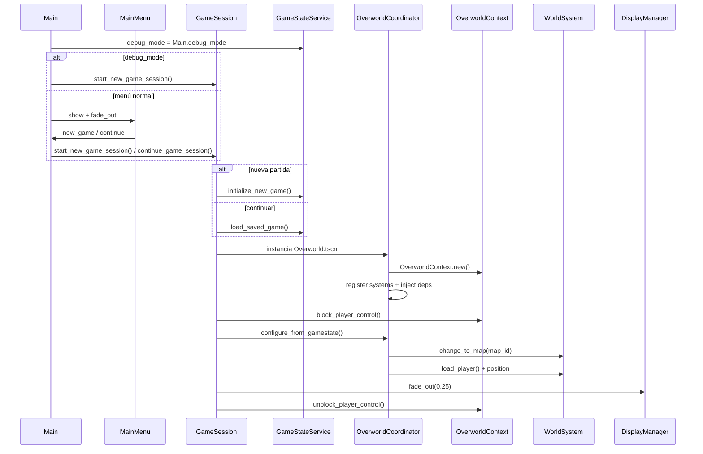

# Arranque de sesión

Cómo se pasa del menú principal a un overworld jugable. Es el mapa mental recomendado antes de documentar combate o eventos.

## Resumen

1. `Main` muestra el menú (o salta directo si `debug_mode`).
2. Crea un `GameSession` dentro de `GameContainer`.
3. `GameSession` inicializa o carga estado vía `GameStateService` e instancia el Overworld.
4. `OverworldCoordinator` crea el `OverworldContext`, registra sistemas e inyecta dependencias.
5. `configure_from_gamestate()` carga mapa + jugador; tras el fade, se desbloquea el control.

## Diagrama de secuencia

## 1. Main — escena raíz

| | |
| --- | --- |
| Script | `Scripts/Main.gd` (`class_name Main`) |
| Escena | `Scenes/Main.tscn` (`run/main_scene` en `project.godot`) |

Responsabilidades:

- Contener `DisplayManager`, `MainMenu` y `GameContainer`.
- Propagar `debug_mode` a `GameStateService.debug_mode`.
- Crear / destruir la `GameSession` activa.

Comportamiento al arrancar (`_ready`):

- Si `debug_mode == true`: oculta el menú y llama a `start_new_game_session()` (atajo de desarrollo).
- Si no: muestra el menú y hace fade desde negro.

Señales del menú:

| Señal | Acción |
| --- | --- |
| `new_game_requested` | `start_new_game_session()` → `load_existing_on_start = false` |
| `continue_requested` | `continue_game_session()` → `load_existing_on_start = true` |
| `quit_requested` | `get_tree().quit()` |

La sesión se instancia desde `res://Scenes/GameSession.tscn` y se añade a `GameContainer`. Solo hay una `active_session` a la vez.

## 2. GameSession — una partida

| | |
| --- | --- |
| Script | `Scripts/GameSession.gd` (`class_name GameSession`) |
| Escena | `Scenes/GameSession.tscn` |

`load_existing_on_start` decide el camino:

| Valor | Flujo |
| --- | --- |
| `false` | `GameStateService.initialize_new_game()` → Overworld |
| `true` | `load_saved_game()`; si falla, cae a nueva partida |

### Nueva partida (`initialize_new_game`)

Valores por defecto actuales (pueden cambiar):

- Mapa `Casa_Red`, tile `(27, 4)`, mirando arriba.
- Con `GameStateService.debug_mode`: spawnea en `Centro_Pokemon` para iterar rápido (PC / curación).

### Carga del Overworld (`_load_overworld_scene`)

Orden importante:

1. Instanciar `Scenes/Overworld/Overworld.tscn` como hijo de la sesión (no cambia la escena raíz).
2. Esperar un frame (el coordinador termina `_ready`).
3. `block_player_control()` en el contexto (el jugador aún no debe moverse).
4. `configure_from_gamestate()`.
5. Si OK → `DisplayManager.fade_out(0.25)` → `unblock_player_control()`.

Helpers de test en el mismo script: `force_new_game()`, `simulate_load_game(...)`.

## 3. OverworldCoordinator — hub del mundo

| | |
| --- | --- |
| Script | `Scripts/Overworld/Overworld.gd` (`class_name OverworldCoordinator`) |
| Escena | `Scenes/Overworld/Overworld.tscn` |

En `_ready`:

1. Crea `OverworldContext` como hijo.
2. Registra sistemas en el contexto (`World`, `Event`, `Warp`, `MO`, `TileEffect`, `TileMotion`, `WildEncounter`, `Overlay`, `EffectsLayer`).
3. Inyecta el contexto a cada sistema (`set_context` / `initialize`).
4. Conecta `WildEncounterSystem.battle_requested` → `_on_wild_battle_requested` → `DisplayManager.start_battle`.
5. Valida sistemas críticos (`Warp`, `MO`, `Event`, `World`). El `Player` se registra más tarde, cuando `WorldSystem` lo instancia.

### `configure_from_gamestate()`

Orquesta la colocación inicial leyendo `GameStateService`:

1. `world_system.change_to_map(map_id)`
2. `world_system.load_player()` si aún no hay jugador
3. Posición y facing en el `OverworldGrid` activo
4. Sincroniza el flag `indoor` según el mapa

## 4. OverworldContext — bus local

| | |
| --- | --- |
| Script | `Scripts/Overworld/Core/OverworldContext.gd` |

No es autoload: vive bajo el coordinador de esa sesión. Sustituye búsquedas globales (`get_node_in_group`, etc.) por un registro con acceso tipado y señales locales (eventos, warps, MOs, bloqueo de control).

API frecuente:

- `get_system("World")` / `get_world_system()`, `get_event_system()`, …
- `request_event`, `request_warp`, `request_mo`
- `block_player_control` / `unblock_player_control`

Detalle de sistemas → [Overworld](../overworld/index.md).

## 5. Servicios globales en este flujo

| Servicio | Papel en el arranque |
| --- | --- |
| `GameStateService` | Mapa, posición, facing, flags, party, save/load; `debug_mode` |
| `DatabaseService` | Ya cargó Resources en su `_ready` (Pokémon, moves, ítems…); el overworld/combate consultan después |
| `DisplayManager` | Fades y UI; no es autoload, es nodo bajo `Main` + `DisplayManager.instance` |

## Cómo depurar el arranque

1. Activa `debug_mode` en el nodo `Main` de la escena para saltar el menú y usar spawn de debug.
2. Revisa la consola tras `OverworldCoordinator._ready` (validación de contexto).
3. Si el jugador no aparece: falla `change_to_map` / `load_player` / grid activo en `configure_from_gamestate()`.
4. Si no puedes moverte: el control puede seguir bloqueado (falla el configure o no se llegó al `unblock`).

## Archivos clave

| Archivo | Rol |
| --- | --- |
| `Scripts/Main.gd` | Raíz, menú, ciclo de vida de la sesión |
| `Scripts/GameSession.gd` | Nueva / continuar + carga Overworld |
| `Scripts/Overworld/Overworld.gd` | Coordinador e inyección de dependencias |
| `Scripts/Overworld/Core/OverworldContext.gd` | Registro y señales del overworld |
| `Services/GameStateService.gd` | Estado de partida |
| `Managers/DisplayManager.gd` | UI, fades, entrada a combate |
| `Scenes/Main.tscn` / `GameSession.tscn` / `Overworld/Overworld.tscn` | Escenas |
