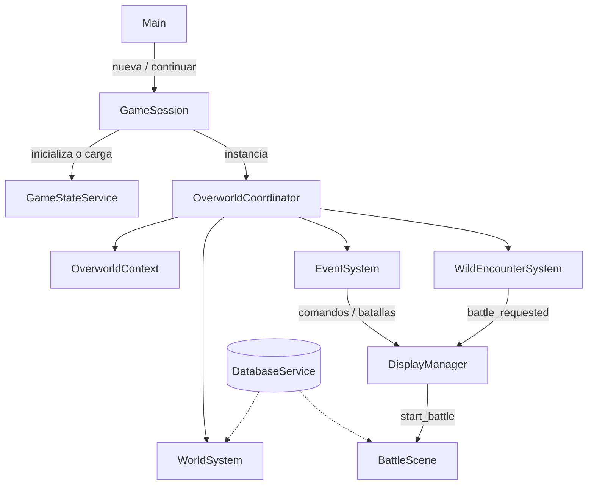

# Arquitectura

Vista de alto nivel del proyecto PK2D (Godot 4.7, GDScript, 512×384).

## Arranque de una partida

La pieza más importante para orientarse en el código:

**[Arranque de sesión](boot.md)** — flujo `Main` → `GameSession` → `OverworldCoordinator` → sistemas del overworld.

## Árbol de escenas en runtime

```text
Main (Scenes/Main.tscn)
├── DisplayManager          # UI global (singleton de instancia, no autoload)
├── MainMenu
└── GameContainer
    └── GameSession         # Una partida (nueva o cargada)
        └── OverworldCoordinator
            ├── OverworldContext
            ├── WorldSystem
            ├── EventSystem
            ├── WarpSystem
            ├── MOSystem
            ├── TileEffectSystem
            ├── TileMotionSystem
            └── WildEncounterSystem
```

`DisplayManager` vive bajo `Main` y se expone como `DisplayManager.instance`. Los combates se lanzan con `DisplayManager.start_battle(...)`.

## Autoloads

Definidos en `project.godot`:

| Autoload | Script | Rol |
| --- | --- | --- |
| `CONST` | `Scripts/AutoLoads/CONST.gd` | Constantes globales |
| `GameStateService` | `Services/GameStateService.gd` | Estado de partida en memoria (mapa, posición, flags, party, save/load) |
| `DatabaseService` | `Services/DatabaseService.gd` | Índice de Resources (Pokémon, movimientos, ítems, etc.) |

## Mapa de `Scripts/`

```text
Scripts/
  AutoLoads/     # Constantes y utilidades globales
  Battle/        # Combate (core, UI, animaciones, IA, efectos)
  Events/        # Eventos, comandos, condiciones, triggers
  Overworld/     # Mundo, actores, grid, efectos de entorno
  Resources/     # Definiciones Resource usadas en runtime
  Runtime/       # Piezas de ejecución compartidas
  Services/      # Servicios de script (además de Services/ raíz)
  UI/            # Interfaces de usuario
  Audio/         # Lógica de audio
  Enums/         # Enumeraciones compartidas
  Tools/         # Utilidades / migraciones
```

## Flujo conceptual



## Próximos temas

- Detalle de [Overworld](../overworld/index.md) (`OverworldContext`, grids, warps)
- [Eventos](../events/index.md) y cola de `EventSystem`
- [Combate](../battle/index.md) desde `DisplayManager.start_battle`
- Contrato `DatabaseService` ↔ Resources en `Resources/Data/`
